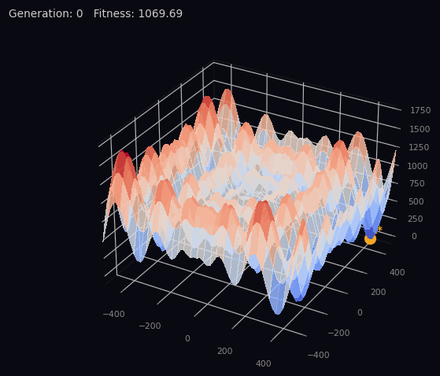

# Comparing Custom Evolution Strategies for the Schwefel Function Against CMA-ES

Exploring  custom Evolution Strategy (ES) variants and how they stack up against the canonical CMA-ES when tasked with minimizing one standard optimization landscape: the **Schwefel function**.

---

## Table of Contents

- [The Schwefel Function](#the-schwefel-function)
- [Algorithms](#algorithms)
  - [Global Single Sigma ES](#1-global-single-sigma-es)
  - [Global Sigma Per Dimension ES](#2-global-sigma-per-dimension-es)v
  - [Per-Individual Per-Dimension Sigma ES](#3-per-individual-per-dimension-sigma-es)
  - [CMA-ES (Baseline)](#4-cma-es-baseline)
- [Setup & Parameters](#setup--parameters)
- [Results](#results)
  - [Global Single Sigma](#global-single-sigma)
  - [Global Sigma Per Dimension](#global-sigma-per-dimension)
  - [Per-Individual Per-Dimension Sigma](#per-individual-per-dimension-sigma)
  - [CMA-ES](#cma-es)
- [Comparison & Analysis](#comparison--analysis)
- [Conclusion](#conclusion)
- [DISCLAIMER](#disclaimer)

---

## The Schwefel Function

$$f(\mathbf{x}) = 418.9829 \cdot d - \sum_{i=1}^{d} x_i \sin\!\left(\sqrt{|x_i|}\right), \quad x_i \in [-500, 500]$$

The Schwefel function is notoriously **deceptive**: its global minimum (≈ 0 at **x\* ≈ 420.97** in each dimension) is geometrically far from the second-best basin, and the landscape is riddled with local minima. Small perturbations can send a search trajectory into entirely different basins. This makes it an ideal stress-test for ES variants.



[Try it interactively here](https://reek312.github.io/Solving_Schwefel_EA05/schwefel_viz.html)

---

## Algorithms

### 1. Global Single Sigma ES

A single shared step-size σ governs mutation for the entire population. After each generation, σ is updated using the **1/5th success rule**: if more than 20% of offspring beat their parent, σ grows; otherwise it shrinks.

> **Comma (µ, λ):** Parents are discarded each generation. Only the top-µ offspring survive.  
**Plus (µ + λ):** Parents compete alongside offspring. Elite solutions are preserved.

```python
# σ update (1/5th rule)
sigma = sigma * exp(±tau * N(0,1))   # + if success_rate > 0.2, else −

# Offspring generation
child[i] = parent[i] + N(0, sigma)
```

---

### 2. Global Sigma Per Dimension ES

Instead of one scalar σ, each dimension gets its own step-size (σ₁, σ₂, …, σ_d). The vector is shared globally across all individuals. Update still uses the 1/5th rule, but each σ_i is perturbed independently.

```python
# Per-dim σ update
sigma[i] = sigma[i] * exp(tau * N(0,1))   # independently per dimension

# Offspring generation
child[i] = parent[i] + N(0, sigma[i])
```

---

### 3. Per-Individual Per-Dimension Sigma ES

Each candidate carries its own vector of step-sizes, `(x, σ)`. Mutation updates both the coordinates and the step-sizes **simultaneously**, allowing self-adaptation without any external rule.

```python
# Self-adaptive mutation
child_x[i]     = parent_x[i] + N(0, parent_sigma[i])
child_sigma[i] = parent_sigma[i] * exp(tau * N(0,1))
```

This is the most expressive variant: the algorithm learns not just *where* to go but *how boldly* to step, independently per dimension and per individual.

---

### 4. CMA-ES (Baseline)

The **Covariance Matrix Adaptation Evolution Strategy** (`pycma`) adapts a full covariance matrix over generations, enabling correlated mutations across dimensions. It is state-of-the-art for smooth, continuous optimization problems and serves as the benchmark here.

Budget was matched: `popsize × maxiter ≈ num_candidates × 7 × num_gen` evaluations.

---

## Setup & Parameters

| Parameter | Value |
|---|---|
| Population size (µ) | 500 |
| Offspring multiplier (λ/µ) | 7× (comma), 4× (plus) |
| Generations | 100 |
| Dimensions tested | 2, 3, 5, 10, 20 |
| Search domain | [−500, 500]^d |
| Initial σ | 0.1 × (x_max − x_min) |
| τ (log-normal learning rate) | 1 / √d |
| Convergence criterion | Schwefel(x) ≈ 0(0.001) |
| Runs per config | Multiple (averaged) |

---

## Results

Metrics tracked across all experiments:
1. **Best fitness history**
2. **Average fitness history**
3. **Sigma / step-size history**
4. **Average final best fitness & coordinates** (all dimensions)
5. Qualitative notes and failure mode analysis

---

### Global Single Sigma

#### Comma (µ, λ)

| Dimensions | Convergence Rate | Notes |
|---|---|---|
| 2D | ~40% | Mode fitness = 0 (global optimum); failed runs still near optimum |
| 3D | ~20% | Sometimes reaches optimum then *escapes* — explaining the lower rate vs Plus |
| 5D | ~20% | Heavily initialization-dependent; no meaningful mode fitness |
| 10D | ~0% | Finds local minima; some coordinates near 420 in lucky runs |
| 20D | ~0% | Same as 10D |


> *Graphs shown: best fitness history, avg fitness history, sigma history — for 3D.*  
> *Observation: the comma variant sometimes climbs to the global basin then gets displaced by a bad offspring batch — visible as a fitness dip before the final plateau.*

#### Plus (µ + λ)

| Dimensions | Convergence Rate | Notes |
|---|---|---|
| 2D | ~90–95% | Robust; almost always converges |
| 3D | ~70% | Remaining 30% still in global basin (fitness < 10); e.g. found: [419.54, 421.24, 418.95], f = 0.778 |
| 5D | ~30–40% | Failed runs still near global basin, not random |
| 10D | Low | More resilient than comma; finds 420-class coords more consistently |
| 20D | Low | Same as 10D |


> *Graphs shown: best fitness history, avg fitness history, sigma history — for 3D.*

---

### Global Sigma Per Dimension

#### Comma (µ, λ)

| Dimensions | Convergence Rate | Notes |
|---|---|---|
| 2D | ~50% | ~20% additional runs in global basin (fitness < 10) |
| 3D | ~15% | Higher tendency to hover just above the global optimum after reaching it; sample run e.g. [421.08, 422.94, 421.18], f = 0.501 |
| 5D | ~5% | Worse than single sigma — likely amplified noise from per-dim perturbation |
| 10D | Similar to single sigma comma | — |
| 20D | Similar to single sigma comma | — |


> *Graphs shown: fitness and sigma histories for 3D, showing the characteristic "hover" above the basin.*

#### Plus (µ + λ)

| Dimensions | Convergence Rate | Notes |
|---|---|---|
| 2D | ~90–95% | Remaining runs all in global basin |
| 3D | ~40% | Rest stay in global basin, just fail to fall into the optimum |
| 5D | ~35–40% | Comparable to single-sigma plus |
| 10D | Similar to single sigma plus | — |
| 20D | Similar to single sigma plus | — |


> *Graphs shown: 3D fitness histories illustrating elitism holding solutions in the basin.*

---

### Per-Individual Per-Dimension Sigma

#### Comma (µ, λ)

| Dimensions | Convergence Rate | Notes |
|---|---|---|
| 2D | ~100% | Virtually perfect |
| 3D | ~100% | Clean convergence; it just works |
| 5D | ~90–95% | Strong; self-adaptation succeeds |
| 10D | ~2–5% | Finds good local minima (6–7/10 coords ≈ 420.xx, fitness often < 300–400) |
| 20D | ~0% | Search space too large; still better than random |


#### Plus (µ + λ)

| Dimensions | Convergence Rate | Notes |
|---|---|---|
| 2D | ~100% | Same as comma — self-adaptation is strong enough that elitism barely matters |
| 3D | ~100% | — |
| 5D | ~90–95% | — |
| 10D | ~2–5% | Same as comma |
| 20D | ~0% | Same as comma |


> *Graphs shown: best fitness, avg fitness, and mean-sigma-per-dimension histories for 3D.*  
> *The sigma-per-dim plot reveals how each dimension independently tunes its step-size as the search zooms in.*

> **Side note:** The numbers above used the same budget as every other variant for a fair comparison. But this algorithm is so far ahead of the rest that its limits weren't really being tested. When pushed to 1800 candidates over 500 epochs, it solved 10D all 3 out of 3 attempts. How far it can actually go is, frankly, a bit scary to find out.

---

### CMA-ES

| Dimensions | Convergence Rate | Notes |
|---|---|---|
| 2D | ~40–50% | Competitive with global single sigma |
| 3D | ~15–20% | Tends to converge at a "good" local basin (e.g., one coord ≈ 420, others ≈ −302 or −124); both success and failure cases shown in graphs |
| 5D | ~1–5% | Comparable to global single sigma comma; better at consistently finding structured local minima |
| 10D | Low | Same story — consistent local minima but global optimum out of reach |
| 20D | Low | Slightly worse than 10D at finding quality local minima |


> *Graphs shown: best fitness history, avg fitness history, global sigma history — for 3D.(for both convergence and failed case)*  
> *Note: CMA's covariance adapts to the basin it first enters; Schwefel's deceptiveness means that basin is rarely the global one.*

---

## Comparison & Analysis

### Global Single Sigma vs. Global Sigma Per Dimension

The performance gap between these two is **smaller in the comma variant** and **larger in the plus variant**, for an interesting reason.

In comma selection, per-dim sigma offers more flexibility per mutation, but also more fragility. Without elitism, a good solution only survives if its offspring are also good. With a single sigma, there's just one step-size that needs to stay reasonable across mutation. With per-dim sigma, there are now d independent step-sizes that can each get corrupted by a bad draw — so the odds of a good parent reliably producing a competitive child get worse with every added dimension. This is exactly why sigma-per-dim *underperforms* single sigma in the 5D comma case: the extra expressiveness is outweighed by the extra ways a good solution can fail to reproduce itself.

The plus variant tells a different story. Elitism means a single lucky child with a well-tuned per-dim sigma survives and propagates. The additional exploration flexibility per dimension is fully leveraged here — per-dim sigma plus clearly beats single-sigma plus in lower dimensions, particularly 2D and 3D.

**Takeaway:** Global sigma-per-dim only shows its advantage when paired with elitism (plus selection). Without it, the extra degrees of freedom become a liability.

### Why Per-Individual Per-Dimension Sigma Dominates

Each individual carrying its own sigma vector means the population maintains **diverse exploration radii** simultaneously. Good solutions don't just get selected — they bring their calibrated step-sizes with them, accelerating local refinement exactly where it's needed. Even without elitism, this self-adaptation generates competitive solutions reliably across generations, which is why comma ≈ plus at this level.

The sharp drop at 10D is not a failure of the algorithm — it's a failure of the search budget. The Schwefel landscape in 10D has exponentially more local basins, and 500 individuals over 100 generations simply can't cover enough ground.

### CMA-ES on Schwefel

CMA-ES is state-of-the-art for **smooth, unimodal or mildly multimodal** continuous landscapes. Schwefel is the opposite. CMA's core strength — adapting a covariance matrix to model the shape of the fitness landscape — assumes that good directions found locally will remain good globally. In Schwefel they don't: the gradient information CMA accumulates points toward the nearest local basin, not the global one, and once it commits to that basin it converges into it with increasing confidence. The deceptive structure ensures that confidence is almost always misplaced. The custom per-individual self-adaptive ES actually **outperforms CMA-ES** here precisely because it never builds that kind of committed directional model — chaotic exploration turns out to be an asset on a deceptive landscape.

### The High-Dimension Wall

At 10D and beyond, all algorithms hit the same wall. Finding the Schwefel optimum requires *every* coordinate to land near 420.97 simultaneously — the probability of even initializing near that point drops exponentially with dimension. But even with a lucky start, the landscape actively fights back: local hills scattered throughout the space look just as promising as the global basin from a distance, and any individual that climbs one pulls the search in the wrong direction. With 500 individuals over 100 generations, the population simply can't cover enough of a 10D or 20D space to find the right basin reliably. Solving Schwefel in high dimensions genuinely requires either bigger budgets, aggressive multi-restart strategies, or methods specifically designed for deceptive multimodal landscapes.

---

## Conclusion

| Algorithm | 2–3D | 5D | 10D+ |
|---|---|---|---|
| Global Single Sigma (Comma) | Moderate | Poor | Fails |
| Global Single Sigma (Plus) | Good | Moderate | Poor |
| Global Sigma Per Dim (Comma) | Moderate | Poor | Fails |
| Global Sigma Per Dim (Plus) | Good | Moderate | Poor |
| **Per-Ind Per-Dim Sigma (Comma)** | **Excellent** | **Very Good** | Poor |
| **Per-Ind Per-Dim Sigma (Plus)** | **Excellent** | **Very Good** | Poor |
| CMA-ES | Moderate | Poor | Fails |

>conclusion is only for the parameters used in this experiemnt as described above (and how with better resources per dim per indi does way better as mentioned below it's results)

The per-individual per-dimension self-adaptive ES is the clear winner for the Schwefel function in up to 5 dimensions. Its ability to tailor step-sizes independently per individual and dimension lets it navigate the deceptive landscape far more effectively than either global sigma variants or CMA-ES.

CMA-ES, despite its theoretical sophistication, is a poor match for Schwefel: its strength lies in exploiting smooth curvature information, and Schwefel offers very little of that globally.

In high dimensions (10D+), no simple ES variant with this budget reliably finds the global optimum.

---

## DISCLAIMER

This README was generated by AI from the source code and my raw notes. The code can be found in this repository, and the original notes can be found [here](https://docs.google.com/document/d/1XF6opnnIYcbFSHNiH7Y_ZKd1iBESr7TGZWnRyIVswC0/edit?usp=sharing).